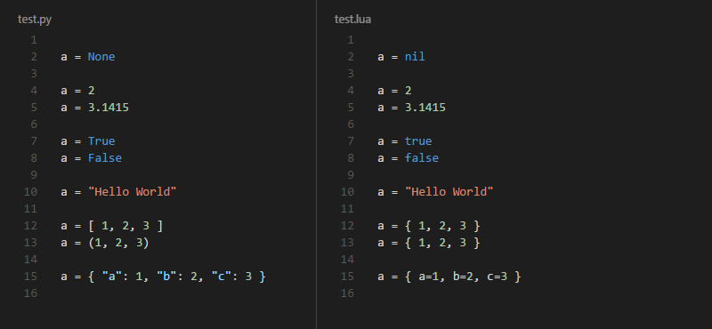

**Status:** In development.

*Information is chronologically added to this README.md file. When enough is implemented
and fleshed out, then the library will be released.*

# PyLua - Python into Lua

[PyLua][PyLua] is a [source-to-source compiler][ss-compiler]
that compiles [Python][Python] into [Lua][Lua].

*[PyLua][PyLua] is developed and tested using Python 3.5.1,
Lua 5.1 and Lua 5.2.*

## Supported Functionality

*The following list, is the features that **currently** can be successfully
translated from [Python][Python] to [Lua][Lua]*

*Features in development has a strike-through.*

- Variables
 - ~~Global & Local Variables (Differentiation)~~
- [Types](#types)
- [Operators](#operators)
- Functions & Nested Functions
- ~~Classes~~
- ~~Importing~~

### Types

*Supported [Python][Python] types, that **currently** can be successfully
translated from [Python][Python] to [Lua][Lua]*

#### Example - Python (left), Lua (right)

*Excluding functions.*

### Operators

*Supported [Python][Python] operators, that **currently** can be successfully
translated from [Python][Python] to [Lua][Lua]*

- Arithmetic (`+`, `-`, `*`, `/`, `%`, `**`, `//`)
- Comparison  (`==`, `!=`, `<>`, `>`, `<`, `>=`, `<=`)
- Assignment (`=`, `+=`, `-=`, `*=`, `/=`, `%=`, `**=`, `//=`)
- Bitwise (`~`, `&`, `|`, `^`, `<<`, `>>`)
- Logical (`not`, `and`, `or`)
- Membership (`in`, `not in`)
- Identity (`is`, `is not`)

#### Example - Python (left), Lua (right)

### License

This module is shared under the MIT license, and is therefore free to use, shared, distribute and modify.
See [LICENSE](https://github.com/MrVallentin/PyLua/blob/master/LICENSE) for more details.

[PyLua]: https://github.com/MrVallentin/PyLua

[Python]: https://www.python.org
[Lua]: http://www.lua.org

[ss-compiler]: https://en.wikipedia.org/wiki/Source-to-source_compiler
